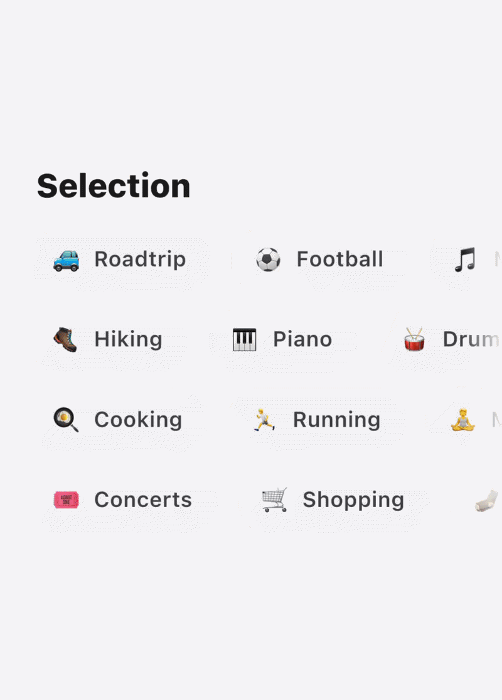
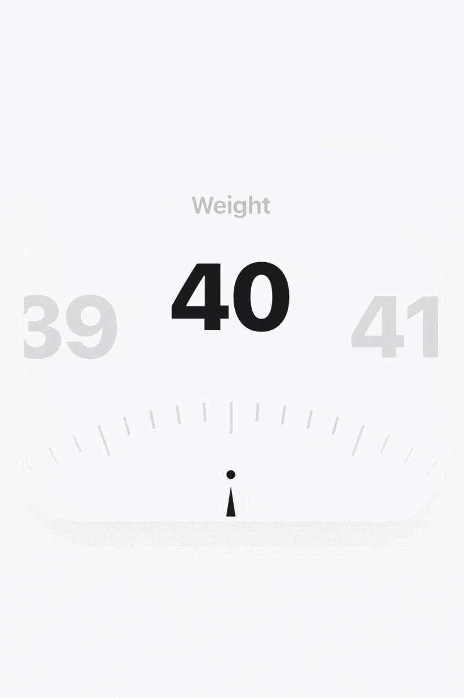

# 🧪 Portal Labs

A curated collection of premium, highly customizable Flutter UI components and experimental interactions. Built with vanilla Flutter animations and high attention to detail.

## 📖 Component Library

This repository acts as a mono-repo for different premium UI components. Each component is designed to be copy-paste ready into your own projects. 

| Component | Description | Location |
|-----------|-------------|----------|
| **[Reveal & Copy](#-reveal--copy)** | Secure scramble reveal for sensitive data with a copy-to-clipboard animation. | `/lib/components/reveal_and_copy/` |
| **[Premium Choice Chips](#-premium-choice-chips)** | Animated selection with flip counter and flying media transitions. | `/lib/components/premium_choice_chips/` |
| **[Modern Weight Picker](#-modern-weight-picker)** | Precision scrollable ruler with haptic feedback and magnetic snapping. | `/lib/components/weight_picker/` |

---

### 🎨 Premium Choice Chips



A playful and engaging interaction component for selections, featuring high-end animations and multi-media support (Emojis, Icons, and Images).

#### Features
- **Multi-media Support:** Use text emojis, Flutter icons, or network/asset images as items.
- **Flying Media Animation:** When an item is selected, a pyramid of 3 media elements (emoji/icon/image) flies up and "lands" in the counter.
- **3D Flip Counter:** An odometer-style flip animation for counting selections.
- **Customizable Labels:** Easily change button labels (e.g., "Interest" vs "Interests").

#### Usage

1. Copy the contents of `lib/components/choice_chips/` into your project.
2. Use the widget:

```dart
import 'path/to/premium_choice_chips.dart';
import 'path/to/models/interest.dart';

PremiumChoiceChips(
  interests: [
    Interest(label: 'Design', icon: LucideIcons.palette), // Icon support
    Interest(label: 'Coffee', emoji: '☕'),               // Emoji support
  ],
  onSelectionChanged: (selected) {
    print('Selected: ${selected.length} items');
  },
)
```

---

### 🔒 Reveal & Copy


A premium interaction designed for safely displaying and copying sensitive information like credit card numbers, passwords, or API keys. 

#### Features
- **Secure by Default:** Values are masked with a custom character (defaults to '×').
- **Elegant Animations:** Smooth scramble reveal effect and a premium shimmer pass upon revealing.
- **Auto-Hide:** Automatically reverts to a masked state after a configurable duration.
- **Micro-interactions:** Integrated copy-to-clipboard functionality with animated visual feedback.

#### Usage

1. Copy `lib/components/reveal_and_copy/reveal_copy_interaction.dart` into your project.
2. Use the widget:

```dart
import 'path/to/reveal_copy_interaction.dart';

RevealCopyInteraction(
  value: '4485 2291 0034 7516',
  onCopied: () {
    ScaffoldMessenger.of(context).showSnackBar(
      const SnackBar(content: Text('Copied successfully!')),
    );
  },
)
```

---

### ⚖️ Modern Weight Picker



A sleek, precision-focused ruler input for numeric values, perfect for fitness apps or physical measurements.

#### Features
- **Precision Ruler:** Custom-painted interactive ruler with major and minor increments.
- **Magnetic Snapping:** Smooth snapping to the nearest value for a tactile feel.
- **Dynamic Feedback:** Real-time value updates as the user scrolls.
- **Premium Styling:** Gradient-based highlighting and modern typography.

#### Usage

1. Copy the contents of `lib/components/weight_picker/` into your project.
2. Use the widget:

```dart
import 'path/to/weight_picker.dart';

WeightPicker(
  initialWeight: 75.0,
  minWeight: 30,
  maxWeight: 250,
  onWeightChanged: (weight) {
    print('Current weight: $weight');
  },
)
```

---

## 🤝 Contributing

Feel free to open issues or submit pull requests if you have ideas for new interactions or improvements to existing ones!
